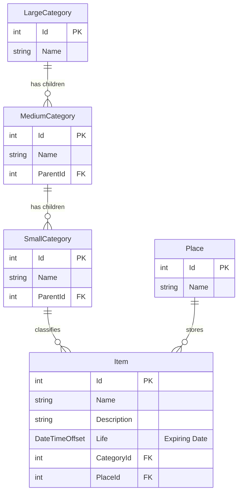

# データモデル (Data Model)

MaxxPro のデータ永続化は、すべて端末ローカルの SQLite データベースファイル（`Caiman.db`）に格納されます。

---

## ER図 (Entity-Relationship)



---

## エンティティ詳細仕様

### 1. Item (品目)
備蓄対象となる個々の物品を表現します。

```csharp
public class Item
{
    public int Id { get; set; }
    public string Name { get; set; } = string.Empty;
    public string Description { get; set; } = string.Empty;
    public DateTimeOffset Life { get; set; } = DateTimeOffset.Now.Date;
    public int CategoryId { get; set; }
    public SmallCategory? Category { get; set; }
    public int PlaceId { get; set; }
    public Place? Place { get; set; }
}
```

- `Life`: 賞味期限・消費期限を表す `DateTimeOffset`。
- `CategoryId`: 紐づく `SmallCategory` の外部キー。
- `PlaceId`: 紐づく `Place` の外部キー。

### 2. Place (保管場所)
物品を保管する物理的な場所を表現します。

```csharp
public class Place
{
    public int Id { get; set; }
    public string Name { get; set; } = string.Empty;
    public HashSet<Item> Items { get; } = [];
    public int ItemsCount => Items.Count;
}
```

### 3. カテゴリ階層 (Category Hierarchy)
大・中・小の3段階ツリーを構成します。

- **LargeCategory**: `Category` を継承。配下に `ObservableCollection<MediumCategory> Children` を保持。
- **MediumCategory**: `ParentId`（LargeCategory）および配下に `ObservableCollection<SmallCategory> Children` を保持。
- **SmallCategory**: `ParentId`（MediumCategory）および所属する `ObservableCollection<Item> Items` を保持。

---

## データベースマイグレーション

アプリ起動時（`App.xaml.cs` の `OnLaunched`）において、EF Core の `Database.MigrateAsync()` が自動実行されます。ユーザーが手動でSQLを実行したりマイグレーションツールを導入する必要はありません。
