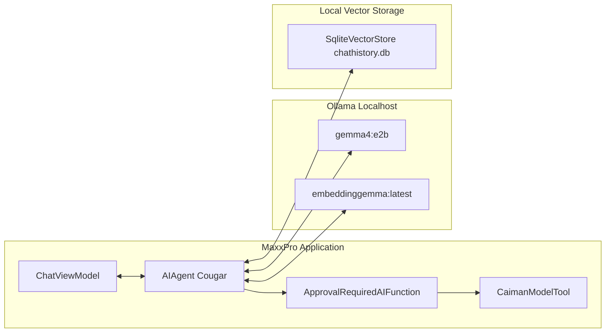

# ローカルAIとツール実行

MaxxPro の最大の特徴の1つは、安全性を担保したローカルAI（Cougar）による備蓄管理の自動化です。

---

## アーキテクチャの概要

MaxxPro は、最新の **Microsoft.Agents.AI** および **Microsoft.Extensions.AI** の標準インターフェースを採用しています。



---

## ツール定義と自動公開

`CaimanModelTool<TModel>` は、EF Core のエンティティ型（`Item`, `Place`, `Category` など）に対して汎用的なCRUD操作を提供し、AIエージェントが呼び出せる関数として自動登録します：

1. `GetAll<TModel>`: 読み取り専用関数（承認不要で即時実行）。
2. `AddModelAsync<TModel>`: 新規追加関数（**要承認**）。
3. `UpdateModelAsync<TModel>`: 更新関数（**要承認**）。
4. `RemoveModelAsync<TModel>`: 削除関数（**要承認**）。

### 承認機能の実装例

```csharp
public IList<AITool> GetAITools()
{
    IList<AITool> aiTools = new List<AITool>();

    // 読み取りはそのまま公開
    AIFunction getFunc = AIFunctionFactory.Create(
        GetAll,
        new AIFunctionFactoryOptions { Name = nameof(GetAll) + typeof(TModel).Name });
    aiTools.Add(getFunc);

    // 破壊的・変更を伴う操作は ApprovalRequiredAIFunction でラップ
    AIFunction addFunc = new ApprovalRequiredAIFunction(
        AIFunctionFactory.Create(AddModelAsync, new AIFunctionFactoryOptions { Name = nameof(AddModelAsync) + typeof(TModel).Name }));
    aiTools.Add(addFunc);

    return aiTools;
}
```

---

## ベクトル履歴プロバイダー

会話履歴は `ChatHistoryMemoryProvider` を介して、`SqliteVectorStore`（`chathistory.db`）に768次元ベクトルとして格納されます。ユーザー名（`Environment.UserName`）とセッションIDに基づいて分離されるため、ローカルマルチユーザー環境でもデータが混ざりません。
