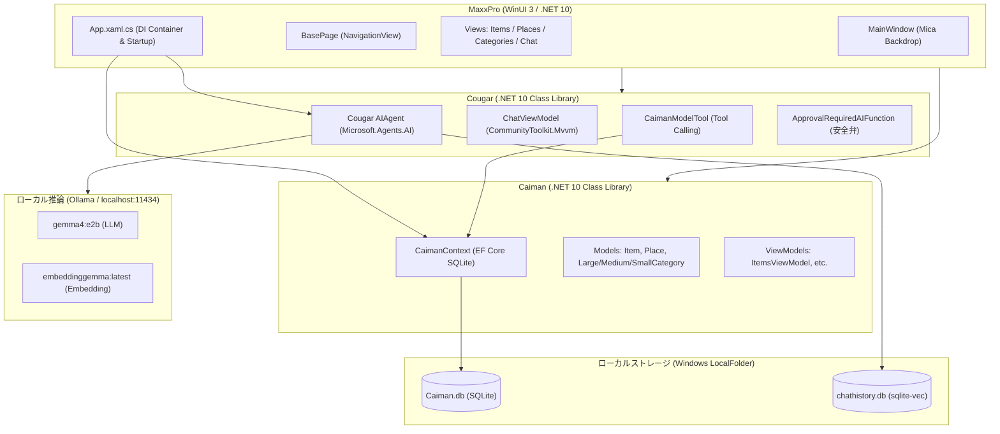

# アーキテクチャ概要

MaxxPro は、クリーンな責務分離と堅牢なローカルファースト原則に基づいて設計されたマルチプロジェクト構成の .NET ソリューションです。

---

## ソリューション構成

```
MaxxPro.slnx
├── MaxxPro      # WinUI 3 デスクトップ アプリケーション本体 (Presentation Layer)
├── Caiman       # ドメインモデル & Entity Framework Core SQLite (Data & Domain Layer)
├── Cougar       # ローカルAIエージェント & モデルツール連携 (AI & Tooling Layer)
└── Buffalo      # Caiman と Cougar の単体・統合テストスイート (Testing Layer)
```

---

## コンポーネント関連図



---

## 各プロジェクトの役割

### 1. MaxxPro (プレゼンテーション層)
- **技術スタック**: WinUI 3, Windows App SDK 1.7, Microsoft.UI.Xaml, CommunityToolkit.Mvvm
- **役割**:
  - ウィンドウ管理（`MicaBackdrop` によるモダンなWindows 11 外観）。
  - ナビゲーションおよび各ビュー（品目一覧、分類管理、保管場所、チャット）。
  - 多言語リソース（日本語 `ja-JP`, 英語 `en-US`, `en-GB`）。
  - DIコンテナ（`ServiceCollection`）によるサービス構成とアプリ起動時の自動DBマイグレーション（`Database.MigrateAsync()`）。

### 2. Caiman (ドメイン・データアクセス層)
- **技術スタック**: Entity Framework Core 10, Microsoft.EntityFrameworkCore.Sqlite
- **役割**:
  - 備蓄管理の核となるドメインエンティティ（`Item`, `Place`, `Category`, `LargeCategory`, `MediumCategory`, `SmallCategory`）。
  - EF Core のコードファーストマイグレーション管理。
  - 各画面用のMVVM ViewModel（`ItemsViewModel`, `PlacesViewModel`, `CategoriesViewModel`）。
  - テスト用モック（`FakeCaimanContextBuilder`）。

### 3. Cougar (ローカルAI連携層)
- **技術スタック**: Microsoft.Agents.AI, Microsoft.Extensions.AI, OllamaSharp, CommunityToolkit.VectorData.SqliteVec
- **役割**:
  - Ollama を用いたローカルLLMとの通信。
  - `IModelTool<TModel>` および `CaimanModelTool<TModel>` による EF Core 操作の AI ツール化。
  - `ApprovalRequiredAIFunction` による更新・削除操作のユーザー承認ゲート。
  - `sqlite-vec` を用いた会話履歴のベクトル保持。

### 4. Buffalo (テスト層)
- **技術スタック**: MSTest / WinUI Test Framework
- **役割**:
  - Caiman および Cougar の全機能に対する単体・結合テスト。
  - CI パイプラインでの自動検証。
