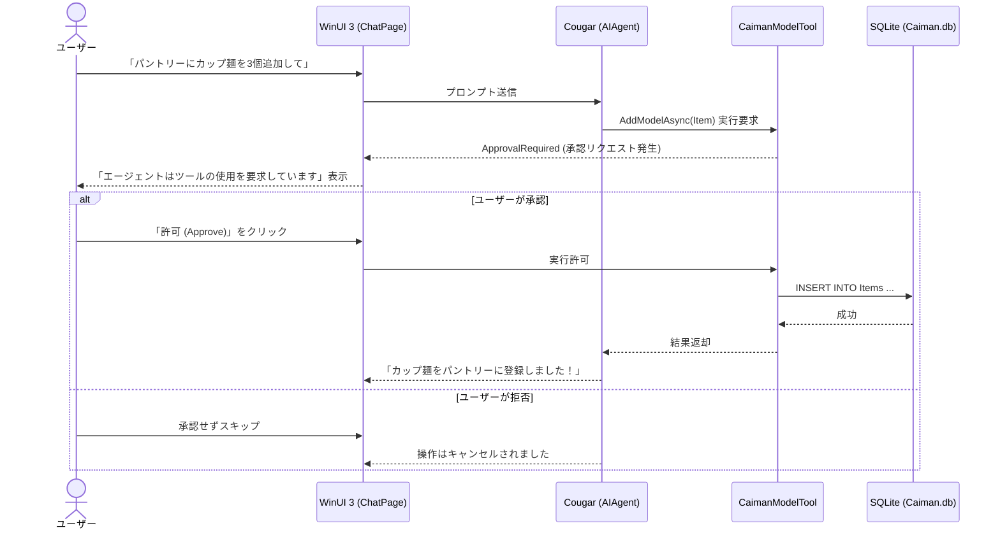

# AIアシスタント「Cougar」

MaxxPro には、Ollama を利用した完全ローカルAIアシスタント「**Cougar**」が統合されています。

---

## ヒューマンインザループ（安全な承認機能）

Cougar は、チャットを通じた問い合わせだけでなく、**データベースの登録・更新・削除などの操作を代行**することができます。

しかし、AIが勝手に大切な備蓄データを改ざん・削除してしまう事故を防ぐため、MaxxPro は **ヒューマンインザループ（Human-in-the-Loop）** 機構を実装しています。

---

## 会話例

### 1. 在庫の確認
> **ユーザー**: 「賞味期限が今年中に切れる品物はある？」  
> **Cougar**: 「確認しました。以下の品物が今年中に期限を迎えます：  
> - 缶詰（ツナ缶）：2026年11月15日  
> - アルファ米（チキンライス）：2026年12月01日」

### 2. 品物の登録依頼
> **ユーザー**: 「防災リュックの中に保存用羊羹を1個追加しておいて」  
> **Cougar**: 「以下の内容で登録ツールを実行してよろしいですか？  
> - 名称: 保存用羊羹  
> - 保管場所: 防災リュック  
> - 分類: 保存食」  
> *(画面上部に「許可」ボタンが表示されます)*  
> *(「許可」をクリックするとデータベースに保存されます)*

---

## ローカルベクトルメモリ

Cougar は、会話履歴をセッションごとにローカルのベクトルデータベース（`chathistory.db` with `sqlite-vec`）に保持します。これにより、過去の会話文脈を踏まえた柔軟な応答が可能です。もちろん、このメモリデータもクラウドには一切送信されません。
