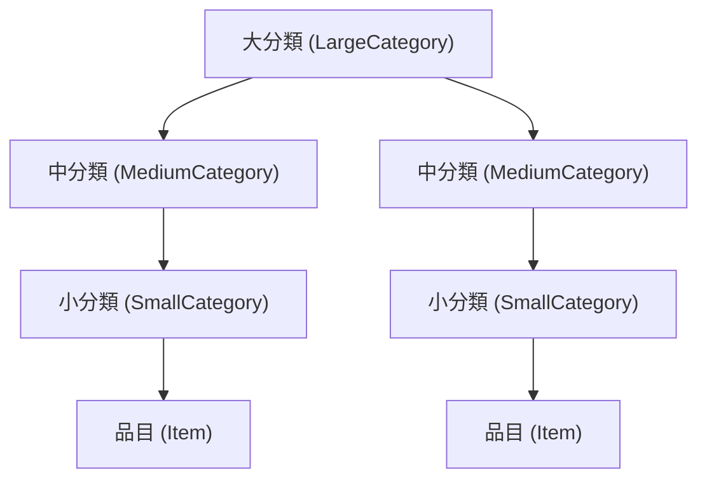

# 分類管理 (Categories)

MaxxPro は、あらゆる備蓄品を迷わず分類できるよう、**3段階の階層構造（大分類・中分類・小分類）** を採用しています。

---

## 階層構造の仕組み

- **大分類 (LargeCategory)**: 最上位のグループ（例: 食料、日用品、救急用品、エネルギー・燃料）。
- **中分類 (MediumCategory)**: 大分類に属するサブグループ（例: 缶詰、レトルト、乾電池、簡易トイレ）。
- **小分類 (SmallCategory)**: 中分類に属する最小グループ。**品目（Item）はこの小分類に直接紐づきます**。

---

## おすすめの分類例

| 大分類 | 中分類 | 小分類 | 該当する品目例 |
| :--- | :--- | :--- | :--- |
| **食料・飲料** | 飲料水 | 保存水 (2L) / 携帯水 (500ml) | 5年保存水 2L×6本 |
| | 主食 | アルファ化米 / パスタ / カンパン | 尾西の白飯、長期保存ビスケット |
| | おかず・惣菜 | 肉魚缶詰 / 野菜スープ | サバ缶、野菜一日これ一本長期保存用 |
| **生活・衛生** | 衛生用品 | 簡易トイレ / からだふきシート | 凝固剤付き簡易トイレ50回分 |
| | 日用品 | カセットボンベ / ライター / ラップ | イワタニ カセットガス 3本パック |
| **防災・救急** | 救急医療 | 救急箱 / 常備薬 / 絆創膏 | 消毒液、滅菌ガーゼ、解熱鎮痛薬 |
| | 防災装備 | ヘルメット / 軍手 / ライト | LEDヘッドライト、防刃手袋 |

---

## 操作方法

1. **大分類の追加**: 分類画面で「大分類を追加」をクリックして名称を保存します。
2. **中分類の追加**: 親となる大分類を選択した状態で「中分類を追加」をクリックします。
3. **小分類の追加**: 親となる中分類を選択した状態で「小分類を追加」をクリックします。
