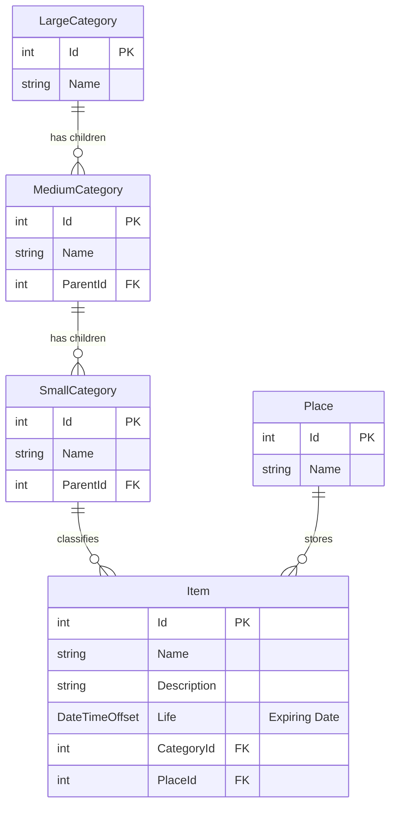

# Data Model

MaxxPro persists all stockpile entities locally in SQLite (`Caiman.db`).

---

## Entity-Relationship Diagram

---

## Entity Details

### Item
Represents a physical stockpile unit.
- `Id`: Unique integer identity.
- `Name`: Title / product label.
- `Description`: Additional notes, quantities, specifications.
- `Life`: Expiration timestamp (`DateTimeOffset`).
- `CategoryId`: Foreign key referencing `SmallCategory`.
- `PlaceId`: Foreign key referencing `Place`.

### Place
Represents a storage room, shelf, or bag where items are kept. Tracks the total item count via `ItemsCount`.

### Category Hierarchy
Structured across three tiers:
- `LargeCategory`: Root category.
- `MediumCategory`: Subcategory under `LargeCategory`.
- `SmallCategory`: Leaf category containing items.
