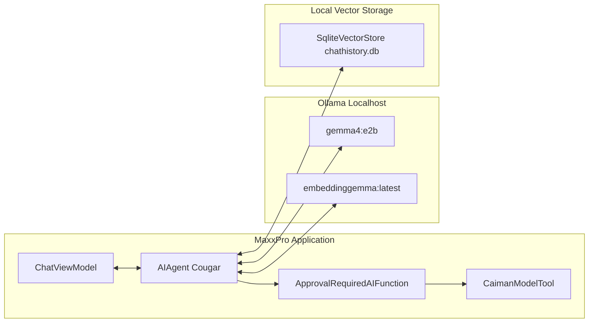

# Local AI & Tool Architecture

Cougar connects local large language models to MaxxPro's database using function calling and safety wrappers.

---

## Architecture Flow

---

## Automatic Tool Registration

`CaimanModelTool<TModel>` generates AI functions for each domain entity:
- `GetAll<TModel>`: Read-only, executes immediately.
- `AddModelAsync<TModel>`: Adds an entity, wrapped with `ApprovalRequiredAIFunction`.
- `UpdateModelAsync<TModel>`: Updates an entity, wrapped with `ApprovalRequiredAIFunction`.
- `RemoveModelAsync<TModel>`: Deletes an entity, wrapped with `ApprovalRequiredAIFunction`.
