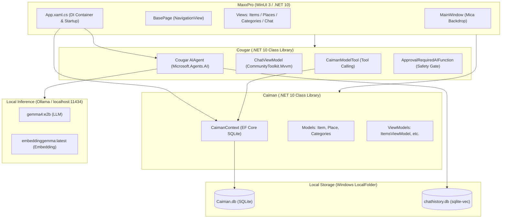

# Architecture Overview

MaxxPro is structured as a multi-project .NET solution with strict separation of concerns and a local-first architecture.

---

## Solution Projects

```
MaxxPro.slnx
├── MaxxPro      # WinUI 3 Desktop App (Presentation Layer)
├── Caiman       # Domain Models & EF Core SQLite (Data & Domain Layer)
├── Cougar       # Local AI Agent & Function Calling Tools (AI Layer)
└── Buffalo      # Integration & Unit Test Suite (Testing Layer)
```

---

## Component Diagram



---

## Project Responsibilities

### 1. MaxxPro (Presentation Layer)
- Built with WinUI 3 and Windows App SDK 1.7.
- Manages top-level windows, Mica backdrop, navigation, and user views.
- Configures dependency injection and triggers database migrations on launch.

### 2. Caiman (Data & Domain Layer)
- Domain entities: `Item`, `Place`, `LargeCategory`, `MediumCategory`, `SmallCategory`.
- EF Core SQLite database context and migrations.
- ViewModels for UI screens.

### 3. Cougar (Local AI Layer)
- Powered by `Microsoft.Agents.AI` and `OllamaSharp`.
- Exposes EF Core operations as AI tools through `CaimanModelTool<TModel>`.
- Enforces user confirmation for destructive actions using `ApprovalRequiredAIFunction`.

### 4. Buffalo (Testing Layer)
- Automated MSTest test suite verifying `Caiman` and `Cougar` components.
