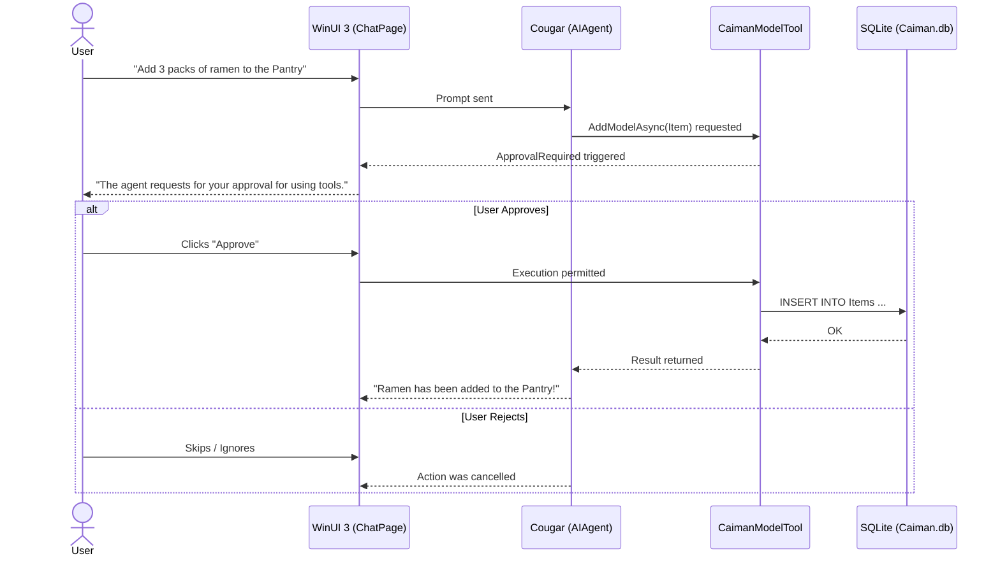

# AI Assistant "Cougar"

MaxxPro integrates **Cougar**, a fully local AI assistant powered by Ollama.

---

## Human-in-the-Loop Safety Guardrails

Cougar can answer questions and perform actions like querying, creating, updating, or deleting database records.

To prevent unintended modifications, all state-changing operations require explicit **Human-in-the-Loop** confirmation.

---

## Example Queries

### 1. Stockpile Status
> **User**: *"What items are expiring before the end of the year?"*  
> **Cougar**: *"Here are the items expiring before December 31:*  
> - *Canned Tuna: Nov 15, 2026*  
> - *Alpha Rice: Dec 01, 2026"*

### 2. Database Modification
> **User**: *"Add 1 box of emergency biscuits to the Go Bag under Emergency Food."*  
> **Cougar**: *"I will register the item with these parameters. Please approve the tool execution."*  
> *(Click **Approve** in the command bar to confirm)*

---

## Local Vector Memory

Conversations are remembered across sessions using an offline vector database (`chathistory.db` with `sqlite-vec`). Your chat logs never leave your device.
