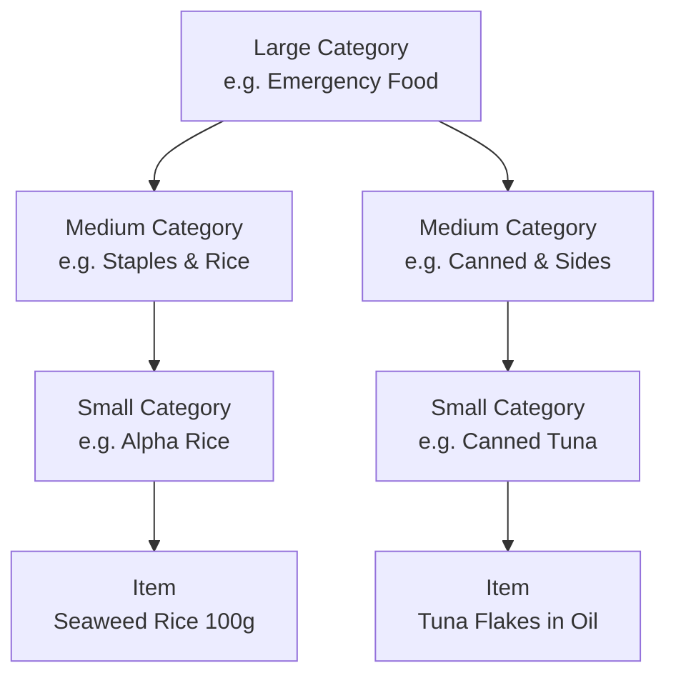

# Category Management (Categories)

MaxxPro organizes inventory with a structured **3-level hierarchy (Large > Medium > Small)**.

---

## Hierarchy Overview

- **Large Category**: High-level grouping (e.g., Food & Drink, Daily Goods, Medical, Power & Fuel).
- **Medium Category**: Subgroup under a Large Category (e.g., Canned Goods, Dry Food, Batteries).
- **Small Category**: Granular group. **Items link directly to Small Categories.**

---

## Best Practices

| Large Category | Medium Category | Small Category | Example Items |
| :--- | :--- | :--- | :--- |
| **Food & Water** | Drinking Water | 2L Bottles / 500ml Bottles | 5-Year Preserved Water 2L |
| | Staples | Alpha Rice / Biscuits | Onisi White Rice, Hardtack |
| | Canned & Sides | Fish & Meat / Soups | Canned Mackerel, Vegetable Soup |
| **Sanitation & Hygiene** | Toilet Essentials | Emergency Toilets / Wet Wipes | Coagulant Portable Toilet Kit |
| | Daily Supplies | Gas Canisters / Lighters / Plastic Wrap | Cassette Gas Cartridges |
| **Medical & First Aid** | First Aid | First Aid Kit / Bandages | Antiseptic, Sterile Gauze, Pain Relievers |
